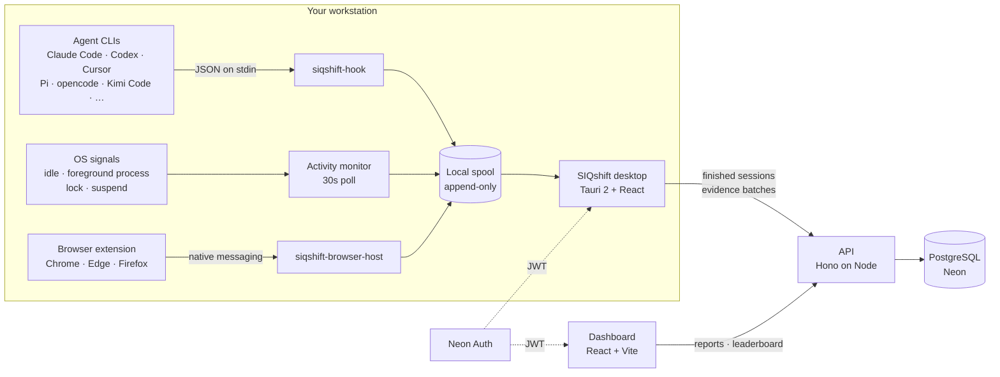

<div align="center">
  

  <h1>SIQshift</h1>

  <p><strong>A time tracker with no timer.</strong><br>
  Keep working. SIQshift records the hours from what your machine and your AI coding agents
  are actually doing, files them under a project, and shows you exactly what it recorded.</p>

  <p>
    <a href="https://github.com/fpresta0607/SIQshift/actions/workflows/ci.yml"></a>
    
    
    
  </p>
</div>

---

## Why this exists

Most timers record a claim: *"I worked four hours on Project X."* Nothing behind it. So the
numbers get padded, everyone quietly knows it, and the report stops meaning anything. Timers
also have to be remembered, which is the other half of why their numbers are wrong.

SIQshift has no timer to remember. Turn recording on once, and the machine's own activity
decides the hours:

- **OS activity.** A slow, read-only monitor folds the machine's state into coarse segments
  (`active`, `idle`, `locked`, `suspended`). No hooks, no injection, no keystrokes. Those
  boundaries are the sessions.
- **Agent sessions.** Claude Code, Codex, and Cursor fire true lifecycle hooks into a tiny local
  spool; Pi and opencode fire theirs from a small extension. A session's working directory
  resolves to a project, so an hour on the leaderboard can name *what* produced it, and the
  runtime is recorded beside the model it was driving without either being read off the other.
  Which runtimes SIQshift knows by name is a roster, not a schema: see
  [**Agent hooks**](#agent-hooks).
- **Browser spans.** A small browser extension matches the active tab against the user's own
  URL rules locally and reports only the verdict — which rule matched, for how long — to a
  native-messaging host the desktop registers. The URL, page title, and browsing history never
  leave the browser.

Reports measure four things, deliberately distinct: **active time** — the union of a
person's working intervals, overlaps collapsed, which can never exceed wall clock and is what
the leaderboard ranks by; **agent time** — the summed runtime of every agent, which parallel
agents can legitimately push past active time; **leverage** — agent ÷ active, shown as
`2.4x`; and **token usage** — the tokens an AI coding agent consumed and produced, read from
its own session logs and reported only where the tool logs them. Concurrency then splits active time into how many agents ran at once. The older
**attributed** / **unattributed** split remains as a per-session label: hours something named
a project for versus hours that fell to the default project because nothing did. Neither is
hidden or penalized. That's the posture: guessing isn't prevented, it's labelled.

The other half of the deal is that the tracked person sees everything the manager sees.
`GET /me/stats` runs the same attribution math as the org report, and
the desktop app has a "what's recorded" panel. Tracking you can interrogate is a tool;
tracking you can't is surveillance.

## Architecture



The spool is the load-bearing idea, and there are four of them: activity segments, agent
events, browser spans, and finished sessions. `siqshift-hook` holds no credentials and opens
no sockets — it
appends one line under an interprocess lock and exits, so a hook can never slow down or block
the agent CLI, and events recorded while the desktop app is closed survive until it next runs.
Uploads are idempotent on client-generated ids, so a crash mid-upload replays instead of
losing or duplicating evidence.

## How session tracking works

Nobody starts anything. While the desktop app is running and recording is on,
SIQshift writes down the hours you spend at the machine and files them under a
project. The consent toggle is the only on/off the product has.

The desktop app is tray-resident by default: closing the window hides it to the
tray and recording continues, and it registers a login autostart on every launch
so hours survive a reboot. Quit lives in the tray menu, and a second launch
surfaces the already-running instance instead of a second monitor.

### Sessions are decided by the machine, not by a person

The monitor already folds the OS into coarse spans (`active`, `idle`, `locked`,
`suspended`). Those spans are now the session boundaries. A session opens on the
first active span, and closes when:

- the machine goes quiet for longer than the **quiet-time limit** (10 minutes by default),
- the screen locks,
- the machine suspends,
- the attributed project changes, or
- the app quits.

Quiet means disengaged, not just hands off: an idle input read is still rescued
as active while media is playing, the user is presenting or busy, or a
microphone is live (see *The OS monitor, in detail*).

It always closes at the **last active moment**, never at "now", so an unattended
tail is never recorded. Quiet gaps shorter than the limit stay inside the session
and are reported as trimmed idle, which the server subtracts from the duration:
a workday is a handful of sessions, not one row per interruption. An open agent
session holds a session through quiet time and lock, because an overnight agent
run is unattended work rather than an abandoned desk.

The open session is written to disk on every 30-second tick. A crash or a forced
shutdown therefore costs the seconds since the last tick, and the next launch
closes the carried session at its last active moment rather than resuming across
a gap nothing can vouch for.

### Where the hours land

Every session belongs to exactly one project, resolved in this order:

1. **The project the person pinned.** The desktop app's picker is an override, not a start button.
2. **The repository an agent is working in.** Agent CLIs report their working directory, and the desktop resolves the repository around it to its **main** checkout, so a shift in a linked worktree lands on the same project as a shift in the checkout that worktree hangs off.
   Three lanes then answer in order, each only when the one before it found nothing: the repository root's path, the working directory's path, and the repository's git remote.
   The two path lanes are `resolveProjectForCwd` matching against the user's path mappings by normalized longest prefix on path-segment boundaries, so `c:/dev/siqshift` matches `c:/dev/siqshift/src` but never `c:/dev/siqshift-extra`.
   The remote lane matches the repository's normalized remote against the `repo_url` a path mapping carries, which is the only lane that reaches a worktree kept outside every mapped root.
   A lane matching two different projects is ambiguous and resolves to nothing rather than to a guess.
3. **The default project**, which is the oldest project on the account. Every new workspace
   already starts with `General`, so there is always somewhere for the time to go.

The project cannot change under an open session: when the answer changes, the
session closes at its last active moment and the next one picks up there. No
second of work is dropped or counted twice.

### How time is counted

The leaderboard reports three time measurements, deliberately distinct:

- **Active time** is the union of a person's working intervals — active OS segments and
  completed sessions — with overlaps collapsed. It can never exceed wall clock, which is what
  makes it the headline the board ranks by.
- **Agent time** is the summed runtime of every agent session. Three agents running for an
  hour in parallel is 3h of agent time inside 1h of active time; that excess is leverage, not
  a bug. Agent time is a consumption number, never an effort number.
- **Leverage** is agent time ÷ active time, shown as `2.4x`; with no active time there is no
  leverage to show.

Active time is then partitioned by **concurrency** — the share with no agent (t0), exactly
one (t1), two (t2), or three-plus (t3+). Both dashboards render that split as labeled rows,
not one cramped sentence: **Human work** is the t0 bucket (no agent running), and the t1/t2/t3+
rows are the agent-assisted share — still the person's hours, split by how many agents ran
beside them at once. An agent still working while the person is away feeds agent time only,
never the person's hours.

**Recorded** is none of those three: it is the whole of a person's sessions, so it also counts
the quiet inside them - the gaps too short to close a session, and the stretches an agent held
open while nobody was at the machine.
Recorded is therefore always at least active time, and the difference is time away from the
keyboard rather than agent time; how much of that difference an agent was actually running for
is the `away` bucket of the concurrency split, and the All-stats card says so only when that
bucket was measured.
The two lists under that card are read against the same recorded total: projects sum to it
directly, and the app list - which measures foreground presence - closes on it with a **Quiet
time** row, the same way the Today card does.

A person's breakdown stops at what is the person's: their active time and those concurrency
rows. Everything the agents themselves did lives on the **Agents tab**, as a map of shifts
grouped by the codebase they worked: the recorded total on top, then one group per repo with
its shifts underneath - each shift naming its runtime, its operator, the model it drove, and
the commits it recorded.
The web tab opens on a board of the people whose agents ran, ranked by agent time, and picking
one narrows the map to their shifts; the desktop gets the map alone, since its Humans tab
already lists every member.
A group's held share appears only once a commit is decided. The concurrency split sums to active time and the
agent split sums to agent time; one shared module, `packages/shared/src/intervals.ts`, computes
all of it so the invariants (`active = t0+t1+t2+t3+`, `agent = Σ n·tn + away`) hold everywhere.

Both surfaces also chart each hour as lightweight SVG with no chart library, with a
**Time | Tokens** switch shown only when the range holds token data: active and agent time on
the time side — agents in green, the person in gray — and tokens in (blue) and out (purple) on
the token side. An hour with no token data breaks the token line rather than drawing a zero
that never happened. Hours are bucketed to the viewer's local midnight-to-midnight calendar,
never UTC. The web dashboard reuses its existing today/7d/30d/90d range filter for the graph;
**All time** is unbounded and has no graph, on either tab in either app — its full history
lives in the CSV export. Both apps chart the course of the day on their main screen, and both
All-stats overlays chart both tabs. The Agents tab's line is folded from the very shifts
on screen, so the line and the list can never disagree, and it plots agent runtime alone with
no person line beside it.

The board lists every member of the workspace, not just the people with recorded time: a
teammate whose range has no evidence reads as `0s`, never as missing.

The desktop app's **What's recorded** panel and the web dashboard's **How SIQshift works**
dialog state these rules word for word.

### Attributed and unattributed

`time_sessions.attribution` records which of those answers applied, and reporting
reads it directly:

| Attribution | What it means | Counts as |
|---|---|---|
| `agent` | an agent's working directory named the project | attributed |
| `selected` | the person picked the project | attributed |
| `default` | nothing named a project, so it fell to the default | **unattributed** |
| `manual` | a legacy row from the retired start/stop timer | attributed |

A session is attributed whole or not at all, so `attributedSeconds +
unattributedSeconds` always equals `durationSeconds`. Unattributed hours are not
penalized or hidden; they are labelled, so a project total nobody vouched for
reads differently from one that something did. `GET /reports`,
`/reports/leaderboard`, `/me/stats`, and the CSV export all carry both figures;
the `attribution = 'default'` bucket is the unattributed one.

### The project scope

The web dashboard's project scope — **All Projects** or one project — filters
the leaderboard, member stats, the Agents tab's shifts, the session list, and the CSV export
at the query layer. The **Unassigned** scope is retired from the picker, so a stored one reads
as **All Projects**.
The scope is picked from the **Change** link in the web dashboard's filing header, and it
narrows that page's own Today card as well as everything in All stats.
The scope and the time range live per member in `user_view_preferences`, read and written
through `GET/PUT /me/preferences` by the web dashboard alone; the desktop All stats overlay
is always unscoped, and its filing header pins which project *recording* files under, which is
a machine-local setting the browser has no equivalent of. Each surface keeps its own time range, because the desktop's calendar "this
week" and the web's rolling "7d" are different questions.

**Legacy rows are untouched.** Every session recorded by the old manual timer
keeps its data and is marked `manual`. The `POST /sessions`, `/sessions/:id/stop`,
and `/sessions/current` routes still work, deprecated, so an installed older
build can finish and upload work it already started; no shipped client calls them.

### How the evidence reaches the server

Four local spools, one discipline. Each is append-only, drained in two phases
(read, then truncate only what the server acknowledged), and idempotent on a
client-generated id, so a crash mid-upload replays rather than losing or
duplicating anything.

| Spool | Written by | Uploaded to |
|---|---|---|
| activity segments | the 30-second monitor tick | `POST /activity/segments` |
| agent events | `siqshift-hook`, one line per lifecycle event | `POST /agent-sessions` |
| browser spans | `siqshift-browser-host`, one line per span verdict | `POST /agent-sessions` |
| finished sessions | the session tracker, as each one closes | `POST /sessions/observed` |

`siqshift-hook` is the reason agent evidence survives everything: agent CLIs run
it from their lifecycle hooks, it appends one line under an interprocess lock (an
advisory `File::try_lock` on a sibling `.lock` sentinel, so a holder that dies
mid-append releases it) and exits. It holds no credentials and opens no sockets,
so a hook can never slow down or block the CLI, and events recorded while the
desktop app is closed wait on disk until it next runs. `siqshift-browser-host`
keeps the same posture — the browser launches it, it holds no credentials and
opens no sockets, and browser spans recorded while the desktop app is closed
wait on disk until it next runs.

Uploads run every five minutes in batches of up to 500. A session older than the
**seven-day** freshness bound is refused rather than backfilled, and per-row
refusals never fail a batch.

### Roster: agents as identities

An agent's identity is durable across sessions, keyed by **(operator, runtime, repository)** per organization - the same person's Claude Code working the same repository is one roster entry, not a new row per shift, and two people running the same runtime on the same repository are two workers rather than one.
The repository is named by its git remote, normalized (`github.com/owner/repo`), and never by the directory it happens to sit in: a worktree, a second worktree, and a second checkout under a different folder name are all one repository and so one roster entry, on this machine and on the next one.
A repository with no remote is identified by its own directory, which keeps local-only work from pooling into a single row.
That directory is the repository's **root** as the desktop resolves it - the main checkout, the parent of the git common directory, not the worktree a shift ran in - so even a remoteless repository's worktrees stay one entry; ["Where the hours land"](#where-the-hours-land) covers what that same root means for project attribution.
Each `agent_sessions` row is that identity's shift.
The operator is whoever's desktop uploaded the shift, so every runtime gets the distinction the day its hooks are wired.
A shift with no repository at all - it is not in one, or the desktop predates the probe and its directory names no codebase either - lands in that person's **unassigned** bucket, a real roster row several shifts share.
The bucket itself never becomes a codebase: when a shift's own commit names one, that shift alone moves onto that codebase's identity and leaves the rest of the bucket behind; nothing is stranded and no default codebase is invented.
The SIQshift project stays on the roster row as a label
that follows the path mappings, not as part of the identity, so re-mapping a
directory never splits or merges a worker. For a shift in a git repo, the desktop app captures the
branch, and the title, commit id and repository path of the commits the shift
added, once the shift ends. "Added" is bounded three ways: the commits reachable
from `HEAD` but not from the commit `HEAD` sat on when the shift opened,
committed by this machine's own git identity, and authored inside the shift —
so a `git pull` part-way through a shift never credits a teammate's work to the
agent. Verification happens later, locally, and read-only: once a day the app
checks each captured commit against the repo already on disk — merged into the
default branch (by ancestry, or by the patch or commit id a squash or rebase
merge leaves behind), explicitly reverted, no longer reachable from any local
ref (orphaned), or still undecided — without ever fetching or pulling. Nothing
is pushed, fetched, or written to the repo at any point; verification only reads
refs and history that are already there.

**The held rate is self-reported.** Verification runs on the machine that ran
the shift and the server records its verdict as given: it is evidence about the
work, attested by the same machine that did the work, and it is presented that
way rather than as an independent audit.

### The OS monitor, in detail

One task wakes every **30 seconds** and asks Windows two read-only questions:
seconds since the last input (`GetLastInputInfo`) and the process name behind the
foreground window (`GetForegroundWindow` then `QueryFullProcessImageNameW`). The
**name only**, never the title. Lock and suspend arrive as broadcasts on a hidden
window (`WM_WTSSESSION_CHANGE`/`WTS_SESSION_LOCK`,
`WM_POWERBROADCAST`/`PBT_APMSUSPEND`); unlock and resume raise no event, because
the next poll closes the span down the same code path.

Hands off is not always away. When the input answer says idle, three more
read-only checks can still rescue the tick as hands-off work: media playing
(`GlobalSystemMediaTransportControlsSessionManager`), presentation or
do-not-disturb busy state (`SHQueryUserNotificationState`), and a live
microphone (the ConsentStore registry's `LastUsedTimeStop`). Each fails closed:
a check that cannot answer never rescues, so a broken signal reads idle exactly
as before, and the checks run only past the idle threshold, never on an
active-work tick.

There are no input hooks, no injection, and no per-keystroke cost. Everything
above the `platform` module is pure logic over an injected clock, so the Win32
calls never run under test.

The **phase-3 precision work** (event-driven foreground changes, UWP process
resolution, clock-gap sleep detection, session-disconnect handling) is designed in
[the phase 3 design](docs/plans/2026-08-09-phase-3-design.md) and is **not on this
branch**. Today the 30-second poll is the only source of per-app boundaries,
Store-packaged apps report as `ApplicationFrameHost.exe`, and Modern Standby sleep
that never fires `PBT_APMSUSPEND` reads as idle rather than suspended.

### The symmetry rule

`GET /me/stats` runs the same attribution math over the same completed-session set
as the organization report. The desktop app's **What
SIQshift is recording** panel (the recording line on the main screen, or *See
exactly what's recorded* in settings) shows live recording state, which evidence
sources are switched on, and the collected and never-collected lists below, in the
same words the dashboard's **How SIQshift works** dialog uses. The person being
tracked sees the same math, and the same explanation, as the person reading the
report.

### What is never collected

Not by policy, but because the code never reads it:

- **Keystrokes and mouse input.** The monitor asks *how long since* the last input, never what it
  was. There are no input hooks anywhere in the codebase.
- **Screenshots**, of any kind.
- **Window titles.** The foreground query returns a process name and stops there.
- **Input content.** SIQshift never records anything typed into a form, chat, or document.
- **Browsing URLs, history, or page content.** The browser extension matches the active tab
  against the user's own URL rules inside the browser and reports only which rule matched;
  the URL, page title, and browsing history never leave the browser. A repository's `origin`
  remote URL is not browsing: it names which repository an agent worked, and is listed under
  *What is collected* below.
- **Document names, file contents, message or email bodies.** Token counts and model
  names read from an AI tool's own session log are the one exception, described in *What is
  collected* below.
- **Injection.** SIQshift never reaches inside or controls another app. The monitor is read-only
  Win32 queries plus broadcasts delivered to SIQshift's own hidden window.

What *is* collected: coarse activity segments with timestamps, the foreground process name, agent
session boundaries with their working directory and - when that directory is in a git repository -
that repository's root and its `origin` remote URL with any embedded credentials removed, which is
what names the repository an agent works, browser spans naming which URL rule matched and
for how long, the start and end of each session the monitor observed, and — for an AI coding shift
in a git repo — the branch name, and the title, commit id and repository path of each commit
captured once the shift ends (see *Roster: agents as identities*). When an AI coding tool keeps a
session log on this computer, SIQshift reads the token counters and the model name from that log —
the numbers and names only, never the prompt or response text — and reports them with the shift.
A working directory can contain a user name, so both it and a repository path are shown only to
the owning user and org admins, and are redacted from logs.

## Repository layout

A pnpm workspace. Contracts flow down; nothing flows back up.

| Package | What lives there |
|---|---|
| **`packages/shared`** | Zod contracts shared by every client and the API, the interval/time model (`intervals.ts`), invite-code and duration helpers, the SIQstack brand stylesheet both frontends import, and the two React entries the frontends share — `./webgl-shader` (the WebGL background) and `./ui` (the hourly chart, the member breakdown, the Today meter rows, the runtime marks, the Agents-tab drawers). React and three are those entries' optional peers, so the API pulls neither. |
| **`packages/database`** | Drizzle schema, SQL migrations, the connection factory, and the migration runner. |
| **`apps/api`** | Hono API: env validation, Neon Auth JWT verification, services (sessions, activity, agent sessions, attribution, reports), Drizzle repositories, CSV export. |
| **`apps/desktop`** | The tray app. React UI over a Tauri 2 Rust host: `monitor.rs` (activity), `spool.rs` (shared with the helper binaries), `uploader.rs`, `recovery.rs`, the All stats overlay, and the `siqshift-hook` and `siqshift-browser-host` bin targets. |
| **`apps/web`** | The dashboard, laid out as the desktop app's own screen: sign-up/sign-in, the filing header, today's clock and Today card, the All-stats overlay (Humans board with per-member breakdowns, Agents map, session history), settings (projects, team, sign out), installer downloads. |
| **`apps/browser-extension`** | The Manifest V3 browser extension: matches the active tab against the user's URL rules locally and reports only the verdict to the desktop's native-messaging host. |

Routes stay thin, services own the rules, repositories own SQL. Every service is tested
against explicit fakes, so the behavior suite needs no database.

## Quick start

**Prerequisites**

- Node **22.18+** (the `scripts/` repairs import the API's own TypeScript through Node's unflagged type stripping)
  and pnpm **10.14+** (`corepack enable`)
- A PostgreSQL database with **Neon Auth** configured — the API verifies JWTs against its JWKS
- For the desktop app: Rust **1.89+** (`File::try_lock`, used by the spool) plus Tauri's system
  dependencies. On Debian/Ubuntu: `libwebkit2gtk-4.1-dev libappindicator3-dev librsvg2-dev patchelf libssl-dev`

**Set up**

```bash
pnpm install
cp .env.example .env          # fill in DATABASE_URL and AUTH_BASE_URL

# The migration runner reads the environment directly rather than loading .env:
DATABASE_URL='postgresql://…' pnpm --filter @siqshift/database migrate
```

**Run**

```bash
PORT=3977 pnpm --filter @siqshift/api dev      # API      → http://localhost:3977
pnpm --filter @siqshift/web dev                # dashboard → http://localhost:5180
pnpm --filter @siqshift/desktop tauri dev      # desktop app (Vite on :1420 in the Tauri shell)
```

> **On ports.** The API defaults to `PORT=3000`, but both clients default to
> `http://localhost:3977` in development — the desktop's fallback is compiled in. Run the API
> on `3977` (as above) or point `VITE_API_BASE_URL` and `SIQSHIFT_API_URL` at `3000`.

**When environment variables are read** — this trips people up:

| Variable | Consumer | Read at |
|---|---|---|
| `DATABASE_URL`, `AUTH_BASE_URL`, `PORT`, `CORS_ORIGINS`, `NODE_ENV` | API | **runtime** |
| `VITE_AUTH_BASE_URL`, `VITE_API_BASE_URL` | web | **build** time, baked into the bundle |
| `SIQSHIFT_AUTH_URL`, `SIQSHIFT_API_URL` | desktop | **compile** time (`option_env!`) |

A release desktop build without the last two **fails the build** rather than shipping an
installer that quietly points at localhost (`src-tauri/build.rs`).

## Commands

Run from the repository root.

| Command | What it does |
|---|---|
| `pnpm typecheck` | `tsc --noEmit` across every package, and the layout suite |
| `pnpm test` | the full Vitest suite (services, routes, contracts, React), the `scripts/` suites under `node --test`, then the layout suite |
| `pnpm test:browser` | the layout suite alone; needs `pnpm exec playwright install chromium` once |
| `pnpm build` | production build of every package |
| `DATABASE_URL=… pnpm --filter @siqshift/database migrate` | apply migrations |
| `pnpm --filter @siqshift/database test:integration` | PostgreSQL migration tests; needs `TEST_DATABASE_URL` |
| `pnpm --filter @siqshift/desktop tauri build` | build desktop installers |
| `cargo test --manifest-path apps/desktop/src-tauri/Cargo.toml` | the Rust suite |
| `cargo clippy --manifest-path apps/desktop/src-tauri/Cargo.toml --all-targets -- -D warnings` | Rust lints, as CI runs them |

A claim about what a page *looks* like is checked in a real browser, never in jsdom
and never against source text: `tests/browser` drives Chromium over the apps' own
stylesheets and the real WebGL background, and it is the tail of `pnpm test`.
jsdom has neither a layout engine nor WebGL, so a rule about columns and a shader's
scale both pass there whatever they actually render.
The suite builds the web app and serves the bundle, so it needs Chromium on the
machine: `pnpm exec playwright install chromium` once, which CI does for itself.

CI runs typecheck → test → build → `docker build` on the API image, plus Rust
fmt/clippy/test, on every push and pull request.

## The API

Everything except `/health` requires `Authorization: Bearer <Neon Auth JWT>`; the user and
organization are derived from verified claims, never from the request body.

| Method | Path | Purpose |
|---|---|---|
| `GET` | `/health` | liveness probe |
| `POST` | `/accounts` | first call after sign-up: create a workspace, or join one by invite code |
| `GET` | `/me` | the signed-in user |
| `GET` | `/organization` | workspace name and invite code |
| `POST` | `/organization/join` | move an account into another workspace |
| `POST` | `/organization/claim-admin` | first signed-in member claims the administrator role in a workspace that has none; refused (`409`) once one exists |
| `GET` | `/projects` | projects the caller belongs to; `?includeArchived=true` lists archived ones so an archive can be undone |
| `POST` | `/projects` | create a project (case-insensitive duplicate names rejected, archived names included) |
| `PATCH` | `/projects/:id` | inline rename or archive |
| `GET` | `/projects/:id/usage` | what deleting the project would take with it |
| `DELETE` | `/projects/:id` | delete (reassign its sessions or delete them with it); admin-only |
| `POST` | `/sessions/observed` | batch upload of finished sessions, idempotent on the client-generated `clientId` |
| `POST` | `/sessions`, `/sessions/:id/stop`, `GET /sessions/current` | **deprecated** manual timer; kept so older installed builds can finish their work |
| `POST` | `/activity/segments` | batch upload of activity segments |
| `POST` | `/agent-sessions` | batch upload of agent lifecycle events |
| `GET` `POST` `PATCH` `DELETE` | `/path-mappings`, `/path-mappings/:id` | map a path prefix to a project |
| `GET` | `/reports`, `/reports/leaderboard`, `/reports/agents`, `/reports/agent-shifts`, `/reports/export.csv` | organization reporting |
| `GET` | `/me/stats` | the caller's totals per project, per app, and per agent; an optional `?userId=` opens a teammate's |
| `GET` `PUT` | `/me/preferences` | the web dashboard's scope+range view state |
| `GET` | `/agents` | the org's roster of agent identities |
| `PATCH` | `/agents/:id` | rename (which registers an anonymous agent), retire, or re-own an agent |
| `POST` | `/agents/:id/merge` | merge one agent into another; admin-only |
| `GET` | `/agents/:id/paystub` | one agent's shifts, captured commits, codebase labels, token usage, per-model session facts, its owner's presence, and an hourly series |
| `POST` | `/shift-commits` | batch upload of commits captured during a shift |
| `POST` | `/agent-usage` | batch upload of token counters read from an agent's session logs |

**Invariants the server enforces**, not the client: a session must end after it starts and
not in the future; it must start inside the 7-day freshness window; its idle seconds cannot
exceed its elapsed time; sessions past 12 hours are flagged `needs_review`; and a session's
project must be one the user is a member of (a composite foreign key, so it can't be
bypassed). A bad row in a batch is rejected on its own and named in the response; the rest of
the batch still lands.

Project names are case-insensitively unique, archived names included. The default project can
be neither archived nor deleted — unattributed time lands there — and the last active project
refuses deletion too; deleting a project is admin-only because it moves or destroys other
members' sessions. Workspaces created before roles existed have no administrator at all,
so the web dashboard calls `/organization/claim-admin` once on each signed-in boot; the
first active member to make the call becomes the admin, and every later call is refused and
silently ignored.

**Attributed seconds** are a session's whole duration when its `attribution` is anything but
`default`, and zero when it is. History can't be backfilled: a session that arrives more than
7 days after it started is refused outright.

## Agent hooks

At startup, SIQshift auto-discovers which agent CLIs are installed (by checking for their
config directories) and silently wires up every one whose hook shape it knows how to merge:
today Claude Code, Codex, and Cursor. Where a config can be merged safely it is, with a
backup and an atomic write; where it can't (Kimi Code, Pi, opencode, Grok, Muse, GitHub
Copilot), the "what's switched on" panel carries the exact snippet to paste. A runtime that
is not installed on this machine reports as absent rather than offering a button that cannot
work.

### The roster is not an allowlist

`packages/shared/src/agent-runtimes.json` is the one place a runtime is declared, and both the
TypeScript side and the Rust host read that same file. It decides what SIQshift can *say* about
a runtime — its display name, its executables, where its hooks live, the snippet to paste — and
never whether a runtime may be recorded. `agent_sessions.source` is text with a shape check
rather than an enum, so a CLI nobody has declared yet is stored under its own id instead of
being rejected or collapsed into `other`. Supporting a new runtime properly is a roster entry;
recording one at all needs nothing.

A runtime is also never inferred from its model, nor a model from its runtime: `pi` driving
`deepseek-v4-pro` is the `pi` runtime, `agent_sessions.model` says what it was driving, and a
hook that names no model records none rather than a guess.

| CLI | Config | Signal quality | Reports model | Registration |
|---|---|---|---|---|
| **Claude Code** | `~/.claude/settings.json` | true session boundaries (`SessionStart`/`SessionEnd`); `PostToolUse` heartbeats available with manual config | never | merged automatically |
| **Codex** | `~/.codex/hooks.json` | true boundaries; same hook shape as Claude Code, told apart by the `--source` its registration passes | never | merged automatically |
| **Cursor** | `~/.cursor/hooks.json` | true boundaries, IDE only — cloud agents never fire them | never | merged automatically |
| **Pi** / **pi-signed** | `~/.pi/agent/extensions/` | true boundaries (`session_start`/`session_shutdown`); reports its model | always | extension to paste |
| **opencode** | `~/.config/opencode/plugins/` | start is a true boundary; no end event, so `session.idle` heartbeats and gaps close it | sometimes | plugin to paste |
| **Kimi Code**, **Grok**, **Muse**, **GitHub Copilot** | per the roster | hook mechanism unconfirmed against any installed version | sometimes | snippet to paste |
| anything else | — | call `siqshift-hook --source <runtime> --event …` yourself; see [Wiring up your own orchestrator](#wiring-up-your-own-orchestrator) | up to you | manual |

**Reports model** says whether the runtime's own hook mechanism can name the model it is
driving: `always` by design on every event, `sometimes` when that depends on your wiring or
on a mechanism not yet confirmed, `never` when the mechanism cannot name one.

Runtimes are listed whether or not they are installed, so a machine that later grows one lights
it up without a code change. Every runtime in the roster has a mark in the UI: opencode uses
its genuine MIT-licensed logo, and the other nine carry original monochrome glyphs drawn for
SIQshift on one coherent grid. Those are deliberately *not* imitations of anyone's brand asset
(which cannot be redistributed in a third-party app); they are SIQshift's own marks naming a
runtime inside its own UI, and need no licence from anyone.

Because `session-end` is never guaranteed (a crash, a `kill -9`), the server reaps agent
sessions with no event for 30 minutes and closes them at their last-seen timestamp - a working
agent heartbeats on every tool call, so half an hour of silence means it is gone. An `end` that
arrives before its `start` is tolerated by upsert, not rejected.

### Wiring up your own orchestrator

Any harness that can run a command at a session's boundaries can record shifts: call the hook
binary once at session start and once at session end.
The full invocation:

```
siqshift-hook --source <runtime> --event session-start --session-id <id> --cwd <dir> \
    [--model <model>] [--occurred-at <ISO8601>]
```

`--event` is `session-start`, `session-end`, or `heartbeat`; `--occurred-at` defaults to now.
An empty `--model` value reads as absent, exactly as passing no flag does, so a runtime that
cannot name its model passes nothing rather than branching its own wiring.

A harness that counts tokens can report them on the same events with `--input-tokens`,
`--output-tokens`, `--cache-creation-input-tokens`, and `--cache-read-input-tokens`.
Each carries the cumulative total for the session so far, never a per-turn delta - SIQshift
keeps the largest number it has seen - and an empty value reads as absent, exactly as
`--model` does.

The standing guarantee: `--source` needs no registration anywhere.
An id the roster has never heard of is recorded under its own name, with no migration and no
code change; declaring it in `packages/shared/src/agent-runtimes.json` only gives SIQshift
more to say about it.

## Privacy

The posture is deliberate, and it is the same in the code as it is here. The collected and
never-collected lists live in
[**What is never collected**](#what-is-never-collected) above; this section is the policy around
them.

- Recording is **on by default** for a new install and gated behind one setting, which is the
  only on/off in the product; disabling it aborts the tasks, so a stopped recorder records
  nothing and no hours accrue at all.
- Switching recording off closes the open session first, so the work already done is kept
  rather than discarded, and earlier hours stay exactly where they are.
- The desktop app's **What SIQshift is recording** panel states, live, what is switched on and
  what is being collected, and offers the one button that changes it.
- The browser extension is installed by default through the Chrome/Edge force-install policy, so
  per-site project attribution works with zero clicks; the settings toggle "Add the SIQshift
  extension to my browsers automatically" is the opt-out, and switching it off removes the policy
  entry, which uninstalls the extension. The extension still reports only which of the user's own
  URL rules matched - the URL, page title, and browsing history never leave the browser.
- Reading token counts and model names from an AI tool's own session log is **on by default** and
  has its own opt-out: the settings toggle "Count tokens and models in my AI tools' session logs".
  Switching it off stops the reader; counters already captured are kept, exactly as switching
  recording off keeps hours already earned. Only the numbers and the model name are read and
  sent - never the prompt or response text.
- A working directory can contain a user name, so it's shown only to the owning user and org
  admins, and redacted from logs like session descriptions are. A captured commit's repository
  path is a working directory and follows the same rule: a paystub read by anyone else carries
  the commit without it. What every member does see is the codebase's **label** - a name like
  `siqshift`, taken from the repository the agent's identity is keyed on when there is one and
  from the path's last segment otherwise - which says which codebase an agent worked in without
  saying where it lives.
- `siqshift-hook` holds no credentials and opens no sockets. The spool file is its entire
  interface.
- The desktop app never persists the session token: Rust keeps it in the OS credential store,
  and the webview never sees it.

Deploying this on employees' machines is a decision with legal weight that varies by
jurisdiction. Disclosure and consent are the deploying company's obligation, not the
software's.

## Testing

Behavior first, plumbing second:

- **Services and routes** are tested against explicit repository fakes: authorization,
  session validation, idempotent replay, attribution ties, staleness reaping, and the
  attributed/unattributed split. No database required.
- **PostgreSQL integration tests** cover migrations and database-level invariants, and skip
  cleanly unless `TEST_DATABASE_URL` points at a disposable branch. Never point them at production.
- **React Testing Library** covers the recording card, the project override, the stats views,
  and every state of the "what's recorded" panel.
- **Rust tests** are pure: the clock and the activity source are injected as traits, so the
  Win32 calls never run under test. The session tracker is driven tick by tick, exactly as the
  poll task drives it.

`pnpm test` and the Rust suite are the gate; a manual GUI checklist lives at the end of
[`docs/plans/2026-08-07-phase-2-implementation.md`](docs/plans/2026-08-07-phase-2-implementation.md)
for what automation can't click.

## Deploying

The API runs on Railway from `apps/api/Dockerfile`, the dashboard on Vercel, and desktop
installers are published to GitHub Releases by tagging (`git tag v0.1.0 && git push origin v0.1.0`).
Full runbook, DNS records, and rollback steps: **[DEPLOY.md](DEPLOY.md)**.

## Design notes

The design documents are the reasoning behind the code — including the alternatives that were
rejected and why.

- [Phase 1 design](docs/plans/2026-08-06-phase-1-design.md) — the manual timer, its data model, and its guardrails (the timer it describes has since been retired)
- [Phase 2 design](docs/plans/2026-08-07-phase-2-design.md) — evidence, attribution, and the anti-manipulation stance
- [Phase 3 design](docs/plans/2026-08-09-phase-3-design.md): browser attribution (built), monitor precision, and the grandmother test
- [Phase 1](docs/plans/2026-08-06-phase-1-implementation.md) · [Phase 2](docs/plans/2026-08-07-phase-2-implementation.md) · [Phase 3](docs/plans/2026-08-09-phase-3-implementation.md) implementation plans
- [Effort v1 implementation plan](docs/plans/2026-08-15-effort-v1-implementation.md): one worker vocabulary, model coverage, and token capture (shipped)
- [Agent identity v2 design](docs/plans/2026-08-16-agent-identity-v2-design.md): operator attribution and repo-keyed agent identities (built; the production reset runbook is in [DEPLOY.md](DEPLOY.md))

## Status and known gaps

Recording is automatic. Browser attribution is built; the monitor-precision half of phase 3 is
still designed and not started. What's deliberately not built yet:

- **Recording is Windows-only.** The `ActivitySource` trait admits macOS and Linux
  implementations, and without one there are no session boundaries to record. Installers are
  built for Windows and macOS today, but a macOS install records nothing until that lands.
- **A foreground process name alone names no project.** It proves the machine was working, not
  what it was working on; only an agent's working directory, a matched browser rule, or a pinned
  project names one, and time with none of those lands in the default project and reads as
  unattributed.
- **One project at a time.** Concurrent agent sessions in different projects do not split a
  session; the last one to report wins, and the boundary between them is a session close.
- **No signing credentials yet** — paid certificates are needed for a real release (see
  DEPLOY.md). Until they arrive, the **Unsigned test installers** workflow is the
  distributable: it republishes the `unsigned-latest` release under fixed asset names,
  which is what the dashboard's **Download for Windows** button links. Windows SmartScreen
  warns, macOS needs `xattr`. Windows debug builds carry the auto-updater
  (see DEPLOY.md); macOS updates are still by hand.
- Evidence can be forged by a determined user. Automatic recording raises the cost and the
  visibility of padding; it does not attempt cryptographic proof.

---

<div align="center">
<sub>No license file is present, so the default applies: all rights reserved.</sub>
</div>
